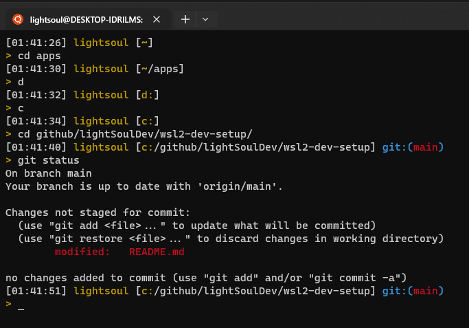

<head>
  <link rel="stylesheet" href="style.css">
</head>

---
## Introduction
---
### **Why WSL?**

Hello, I've been using Dualboot `PopOs + Windows 10` for my development needs for the past decade. However, constantly rebooting between the two has become tiresome, especially since I've started using photo editing software more frequently, and the Windows version of CaptureOne is superior for that.

As a result, I've decided to explore WSL2 for my development needs, especially since it now supports seamless Docker integration. By following the steps outlined in this guide, you can set up a development environment for almost anything. While I'll primarily be using it for `c/c++, golang, rust, react/react native + node.js, and lua`, you can customize it to suit your needs using this guide as a starting point.

### **What should I expect?**

In this guide, you will be provided with a step-by-step process to install and enable WSL2 on your `Windows 10 or 11` system, along with instructions on setting up a Linux distribution that can be utilized for a wide range of development purposes. We will use `Ubuntu` as our WSL distro.

---
## Prerequisites
---
Before you begin, make sure that your system meets the following requirements:

- A `64-bit` version of Windows.
- For x64 systems: Version `1903 or later`, with `Build 18362 or later`.
- For ARM64 systems: Version `2004 or later`, with `Build 19041 or later`.
- A processor with support for virtualization, such as `Intel VT-x or AMD-V`.
- Enable the `Virtual Machine Platform` optional feature.
---
You can check your Windows version by opening the Start menu `win + r` and searching for `winver`.
<br/>
You can enable the `Virtual Machine Platform` by using one of the following methods:

<details>
<summary><b>Method 1: Windows features</b></summary>

1. Open the Start menu and search for `Turn Windows features on or off`.
2. Scroll down and check the box next to `Virtual Machine Platform`.
3. Click `OK` and wait for the feature to be installed.

</details>

<details open>
<summary><b>Method 2: Using Powershell</b></summary>

Open PowerShell as an `administrator` and run the following command:
```powershell
> Enable-WindowsOptionalFeature -Online -FeatureName VirtualMachinePlatform
```
Or you can use this commaind:
```powershell
> dism.exe /online /enable-feature /featurename:VirtualMachinePlatform /all /norestart
```
</details>

---
## Enabling WSL2
---

<details>
<summary><b>Method 1: Windows features</b></summary>

1. Open the Start menu and search for `Turn Windows features on or off`.
2. Scroll down and check the box next to `Windows Subsystem for Linux`.
3. Click `OK` and wait for the feature to be installed.

</details>

<details open>
<summary><b>Method 2: Using Powershell</b></summary>

Open PowerShell as an `administrator` and run the following command:
```powershell
> Enable-WindowsOptionalFeature -Online -FeatureName Microsoft-Windows-Subsystem-Linux
```
Or you can use this commaind:
```powershell
> dism.exe /online /enable-feature /featurename:Microsoft-Windows-Subsystem-Linux /all /norestart
```
</details>

---
## Set Default WSL
---
Once the feature is installed, open PowerShell as an administrator and run the command above to set WSL2 as the default version.

```powershell
> wsl --set-default-version 2
```

---
## Installing a Linux Distribution
---
> **Note**  
> Restart your computer after installing WSL2 and setting the default version to avoid errors during Linux distribution installation.

<details open>
<summary><b>Method 1: Microsoft Store</b></summary>

1. Open the Microsoft Store and search for [Ubuntu](https://www.microsoft.com/en-us/p/ubuntu/9nblggh4msv6?activetab=pivot:overviewtab).
2. Click `Get` and wait for the installation to complete.

</details>

<details>
<summary><b>Method 2: Manual Installation</b></summary>

> Alternatively, you can download the Linux distribution of your choice from the [official website](https://docs.microsoft.com/en-us/windows/wsl/install-manual) and install it manually.

1. Download the `.appx` file for your Linux distribution of choice from the [official website](https://docs.microsoft.com/en-us/windows/wsl/install-manual).
2. Open PowerShell as an `administrator` in your `download folder` and run the following command:
```powershell
> Add-AppxPackage .\<file>.appx
# Replace <file> with the name of the .appx file you downloaded
> Add-AppxPackage .\Ubuntu.appx
```
3. Once the package is installed, you can import the Linux distribution by running the following command:
```powershell
> wsl --import <distro_name> <install_location> <appx_file>
# Replace <distro_name> with the name of your Linux distribution
# Replace <install_location> with the location where you want to install the Linux distribution
# Replace <appx_file> with the path to the .tar file you downloaded
> wsl --import Ubuntu C:\Users\username\Ubuntu\ .\Ubuntu.appx
```
4. Launch the Linux distribution by running the following command:
```powershell
> wsl -d <distro_name>
# Replace <distro_name> with the name of your Linux distribution
> wsl -d Ubuntu
```

</details>

---
## Setting up your Windows Tools
---
Before we dive into the linux side of things, we need to install a few things on the Windows side of things. This will allow us to use the Linux distro as a full-fledged development environment.
### **Install Windows Terminal**

1. Open the Microsoft Store and search for [Windows Terminal](https://www.microsoft.com/en-us/p/windows-terminal/9n0dx20hk701?activetab=pivot:overviewtab).
2. Click `Get` and wait for the installation to complete.
3. You can set the Ubuntu as the `default profile` in settings.

### **Enable WSL integration in Docker Desktop**

1. Open the Docker Desktop and click on the `Settings` icon.
2. Click on the `Resources` tab.
3. Click on the `WSL Integration` option.
4. Check the box next to the Linux distributions you want to integrate with Docker.
5. Click the `Apply & Restart` button to apply the changes and restart Docker Desktop.
6. Now you can use docker commands from the Ubuntu terminal. Run `docker run hello-world` to test it out.

### **Install WSL extensions for VS Code**

1. Open the VS Code extensions tab by clicking on the `Extensions` icon in the left sidebar.
2. Search for `Remote - WSL` and click on the `Install` button.
3. Click on the `Reload` button to reload VS Code.
4. Now you can use `code .` in your Ubuntu terminal to open the current directory in VS Code.

---
## Setting up your Linux Distribution
---
Once the installation is complete, open the Start menu and search for `Ubuntu`. Click on the application to launch it.

> **Note**  
> The first time you launch the Linux distribution, it will ask you to create a new user account and password. You can use this account to log in to the Linux distribution.

### **Updating and installing musthave packages**

1. Update the package list and upgrade all packages to their latest version by running the following command:
```bash
$ sudo apt update && sudo apt upgrade -y
```
2. Install the `build-essential` package by running the following command:
```bash
$ sudo apt install build-essential
```
3. Install the `curl`, `wget` packages by running the following command:
```bash
$ sudo apt install curl wget
```

### **Let's configure our `.bashrc` before diving in deeper**

> **Note**  
> I will use `vscode` as my code editor, you can use any editor of your choice.

1. Open the `.bashrc` file by running the following command:
```bash
$ code ~/.bashrc
```
2. I always disable the `bell` sound.
```sh
bind 'set bell-style none'
```
3. I also like enabling auto-completion for hidden files.
```sh
bind 'set match-hidden-files on'
```
4. Ssh agent not working properly on a WSL distro? No worries, we can fix that.
```sh
eval `ssh-agent` > /dev/null 2>&1
```
5. Then I would probably add the `.env` file. And put there my environment variables.
```sh
if [ -f ~/.env ]; then
    . ~/.env
fi
```
6. Don't forget to enable and set the `bash history`.
```sh
# My config looks like this, but you can change it to your liking.

HISTCONTROL=ignoreboth
HISTTIMEFORMAT="%F %T "

shopt -s histappend

HISTSIZE=1000
HISTFILESIZE=2000
```
7. I also like to add some aliases to the `.bash_aliases` file.
```sh
# View Git status.
alias gs='git status'
# Add a file to Git.
alias ga='git add'
# Add all files to Git.
alias gaa='git add --all'
# Commit changes to the code.
alias gc='git commit'
# View the Git log.
alias gl='git log --oneline'
# Create a new Git branch and move to the new branch at the same time. 
alias gb='git checkout -b'
# View the difference.
alias gd='git diff'

# Docker aliases.
alias dcup='docker-compose up -d'

alias d='cd /mnt/d/wsl'
alias c='cd /mnt/c/Users/lightsoul/wsl'
alias bashrc='source ~/.bashrc'
```
8. Finaly lets setup our `prompt`.

This is how my prompt looks like, but you can change it to your liking.
<!-- image -->


`.bashrc` file:

```sh
# Get Git branch of current directory
git_branch () {
    if git rev-parse --git-dir >/dev/null 2>&1
        then echo -e ""$(git branch 2>/dev/null| sed -n '/^\*/s/^\* //p')
    else
        echo ""
    fi
}

# Set a specific color for the status of the Git repo
git_color() {
    local STATUS=`git status 2>&1`
    if [[ "$STATUS" == *'Not a git repository'* ]]
        then echo "" # nothing
    else
        if [[ "$STATUS" != *'working directory clean'* ]]
            then echo -e '\033[0;31m' # red if need to commit
        else
            if [[ "$STATUS" == *'Your branch is ahead'* ]]
                then echo -e '\033[0;33m' # yellow if need to push
            else
                echo -e '\033[0;32m' # else green
            fi
        fi
    fi
}

git_status() {
    local STATUS=`git status 2>&1`
    if [[ "$STATUS" == *'ot a git repository'* ]]
        then echo "" # nothing
    else
        echo -e "\033[0;36mgit:($(git_color)$(git_branch)\033[0;36m)"
    fi
}

# It might be inconvenient to mutate the PWD, but it's wery comfortable for me. Because I have a lot of projects in different windows directories like /mnt/c/Users/lightsoul/wsl
# So I decided to replace the path to the current directory with a shorter one
replace_path() {
    if [[ "$PWD" == *"/mnt/c/Users/lightsoul/wsl"* ]]; then
        local new_path="$(pwd | sed 's|/mnt/c/Users/lightsoul/wsl||')"
        echo -e "\033[0;37m[\033[0;33mc:\033[0;37m$new_path]\033[0m"
    else 
        if [[ "$PWD" == *"/mnt/d/wsl"* ]]; then
            local new_path="$(pwd | sed 's|/mnt/d/wsl||')"
            echo -e "\033[0;37m[\033[0;33md:\033[0;37m$new_path]\033[0m"
        else
            if [[ "$PWD" == *"/home/lightsoul"* ]]; then
                local new_path="$(pwd | sed 's|/home/lightsoul||')"
                echo -e "\033[0;37m[\033[0;33m~\033[0;37m$new_path]\033[0m"
            else
                echo -e "\033[0;37m[$PWD]\033[0m"
            fi
        fi
    fi
}


export PS1='\[\033[0;37m\][\[\033[0;37m\]\t\[\033[0;37m\]] \[\033[0;33m\]\u\[\033[0;35m\] $(replace_path) $(git_status)\n\[\033[0;33m\]> \[\033[00m\]'
```

> **Note**  
> Don't forget to source the `.bashrc` file by running the following command:
> ```bash
> $ source ~/.bashrc
> ```
> Or just restart the terminal.

### **Installing Node.js**

1. Install the `nvm` package by running the following command:
```bash
$ curl -o- https://raw.githubusercontent.com/nvm-sh/nvm/<version>/install.sh | bash
# replace <version> with the latest version from https://github.com/nvm-sh/nvm
$ curl -o- https://raw.githubusercontent.com/nvm-sh/nvm/v0.39.3/install.sh | bash
```

2. Install the `node` package by running the following command:
```bash
$ nvm install <version>
# replace <version> with the version you want to install, you can install multiple versions of node
# and switch between them using the nvm use <version> command
$ nvm use 18
```

3. Install the `yarn` package by running the following command:
```bash
$ npm install -g yarn
```

### **Installing Golang**

1. Install the `golang` package by running the following command:
```bash
$ sudo apt install golang
```

2. Create a `go` directory in your home directory.
```bash
$ mkdir ~/go
```

3. Add `GOPATH` and `GOROOT` to your `.env` file, I also added `APPS` to my `.env` file, because I like to keep all my apps in one place.
```sh
export APPS="$HOME/apps"
export GOPATH="$HOME/go"
export GOROOT="/usr/local/go"

export PATH="$PATH:$APPS:$GOPATH/bin:$GOROOT/bin"
```

### **Installing Rust**

1. Install the `rust` package by running the following command:
```bash
$ curl --proto '=https' --tlsv1.2 -sSf https://sh.rustup.rs | sh
```

2. Add `RUSTUP_HOME` and `CARGO_HOME` to your `.env` file.
```sh
export RUSTUP_HOME="$HOME/.rustup"
export CARGO_HOME="$HOME/.cargo"

export PATH="$PATH:$APPS:$GOPATH/bin:$GOROOT/bin:$RUSTUP_HOME/bin:$CARGO_HOME/bin"
```

<b>`... to be continued`</b>

---
## Configure SSH keys and remote repositories
---

### **Generating SSH keys**

1. Generate a new SSH key by running the following command:
```bash
$ ssh-keygen -t ed25519 -C "your_email@example.com"
```

2. If you added `eval 'ssh-agent' > /dev/null 2>&1"` to your `.bashrc` file, ssh-agent will be started automatically. If not, you can start it manually by running the following command:
```bash
$ eval "$(ssh-agent -s)"
```

3. Add your SSH private key to the ssh-agent by running the following command:
```bash
$ ssh-add ~/.ssh/<private_key>
# replace <private_key> with the name of your private key
$ ssh-add ~/.ssh/id_ed25519
```

4. Add your SSH public key to your GitHub account by following the instructions on [GitHub Docs](https://docs.github.com/en/github/authenticating-to-github/adding-a-new-ssh-key-to-your-github-account).